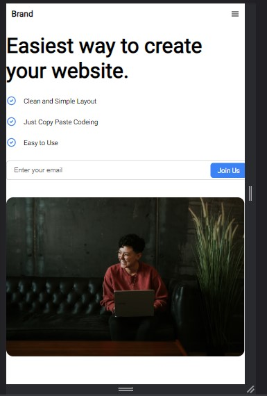
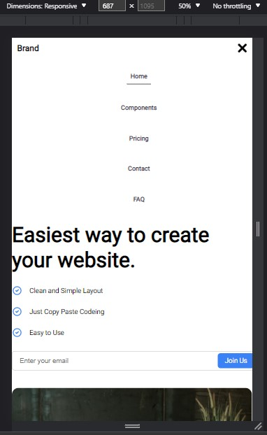

web site: 
https://sbj2058.github.io/mobile-web-multimedia/
bijaykumarkarki.me

Herosection Responsive with hamburger menu using jQuery

1. Home Page in Desktop View

2. In mobile view

3. Hamburger menu display

Using jQuery the menu is shown and hidden
